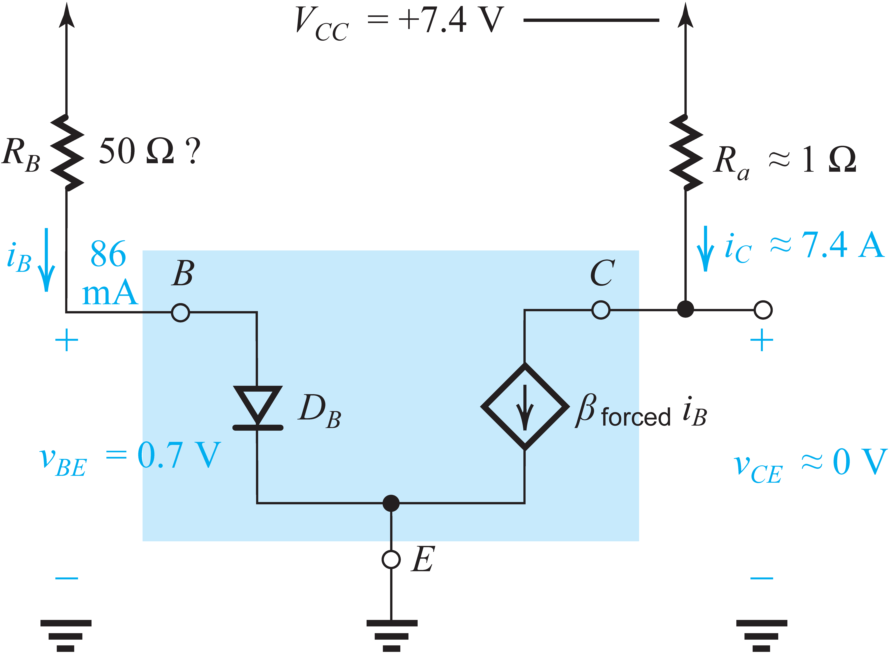
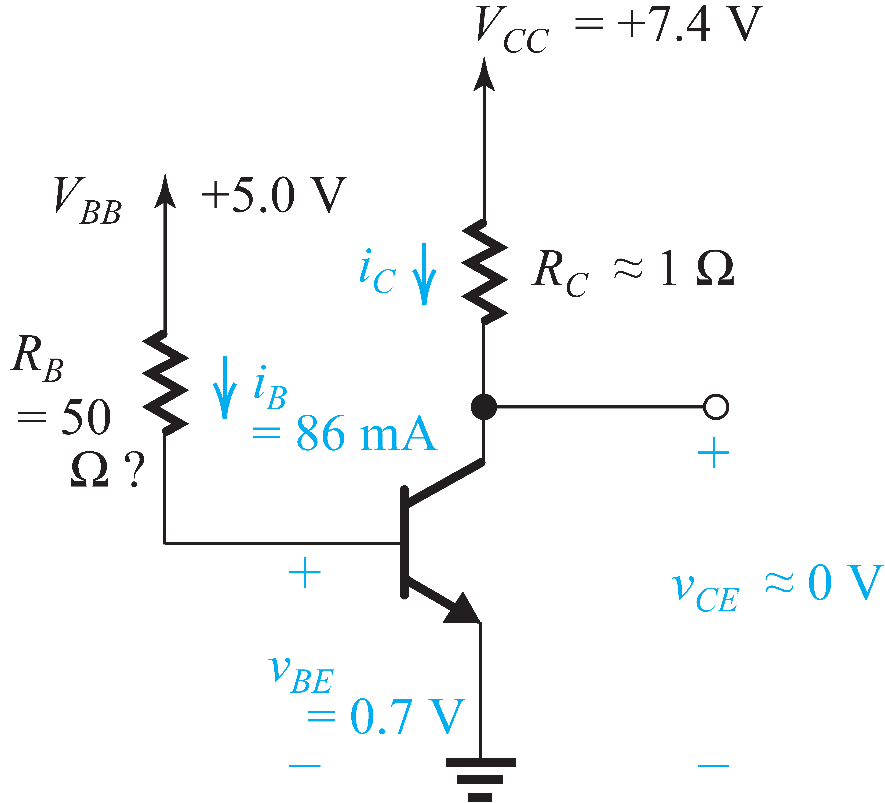

# RC Car Mark II

I sought to prove my resourcefulness especially for this project by purchasing no parts for it and using only ones that I had on-hand. This posed a fair challenge.

## Power Electronics Design — Custom Unidirectional Motor Driver

The car is designed to be steered rather than reversed. The car has power electronics to run its motor in one direction. To achieve the desired current gain from the car’s microcontroller to its motor upon starting, the motor driver has two stages of switching devices. A bidirectional motor driver would use an H-bridge circuit topology, which in turn requires four times as many secondary-stage and twice as many primary-stage switching devices assuming the latter stage is still used, either of which was decided against.

| Note |
|:-----|
| Motor soft start functionality may be implemented using pulse-width modulation (PWM) aboard the car’s microcontroller. |

Naturally, a power transistor was desired for at least the secondary stage (a single-package Darlington transistor would be used for both primary and secondary stages). However, the only solid-state power switching devices on-hand happened to be a mere 1.5-A power transistor and a more capable two-way triode thyristor (TRIAC) which is of course unsuitable. I had many 0.6-A NPN bipolar junction transistors (BJTs) to test in parallel with each other in attempt to increase their current capacity to that drawn by the motor. They were used in a common-emitter amplifier configuration, except as switching devices rather than amplifiers.


----

 

Figure 1: Modified from [1].

----

 **[Darlington pair](https://en.wikipedia.org/wiki/Darlington_transistor):** input transistor (), output transistor(s?)(TBD) ()  …


- **Which kind of switching device?**

  Medium-power NPN [bipolar junction transistor (BJT)](https://en.wikipedia.org/wiki/Bipolar_junction_transistor)’s on-hand.

  `PN2222A-D32`

- **Which circuit topology/configuration?**

  Overall: [common-emitter](https://en.wikipedia.org/wiki/Common_emitter) ~~amplifier~~ *switching device*.

  [Darlington pair](https://en.wikipedia.org/wiki/Darlington_transistor).

- **Which transistors? How many? How many stages? Which ‘region’ of operation?**

  Stage 1: 600-mA [or less] NPN’s (×1) in saturation. Alternative: motor driver board.
  Stage 2: 600-mA NPN’s (×12) pushing saturation.

- **What current-limiting resistance? Which resistors? How many?**

  


**Failure analysis:**

- Factor 1: One-at-a-time activation and subsequent burnout of all stage 2 BJTs.

- Factor 2: Nonzero load (non-frictional) torque (‘freewheeling’).

  


## [Powertrain](https://en.wikipedia.org/wiki/Powertrain) Design


**[Brushed DC electric motor](https://en.wikipedia.org/wiki/Brushed_DC_electric_motor):**

- Model airplane propeller drive.

- No datasheet or specifications within reach.

  ```
  51287V2
  610223-1(B)
  ```


### [Drivetrain](https://en.wikipedia.org/wiki/Drivetrain) Design


**Alternatives:**

- +1 three-to-one’s $ \implies $ too slow
- −1 three-to-one’s $ \implies $ too fast
- +1 two-to-one’s $ \implies $ not enough chassis space
- −1 three-to-one’s + 1 two-to-one $ \implies $ not enough chassis space — ?
- −2 three-to-one’s + 1 two-to-one $ \implies $ too fast


## [Chassis](https://en.wikipedia.org/wiki/Chassis) Design


LEGO Technic

| Components                                             | Dimensions (Approx.) |
| ------------------------------------------------------ | -------------------- |
| [Frame](https://en.wikipedia.org/wiki/Vehicle_frame)   | 12 cm × 12 cm        |
| [Axle Track](https://en.wikipedia.org/wiki/Axle_track) | 20 cm                |
| [Wheelbase](https://en.wikipedia.org/wiki/Wheelbase)   |                      |
| Length                                                 | 17 cm                |
