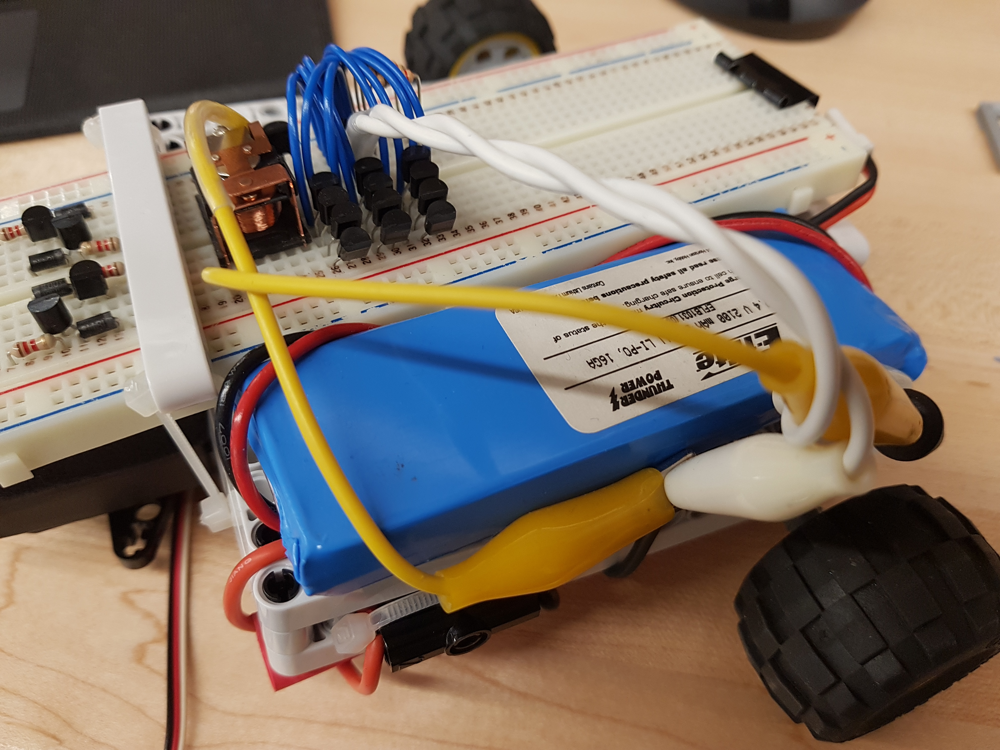
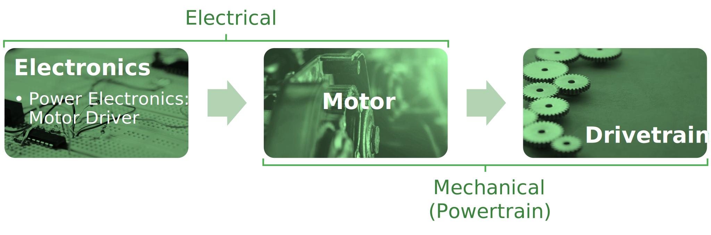
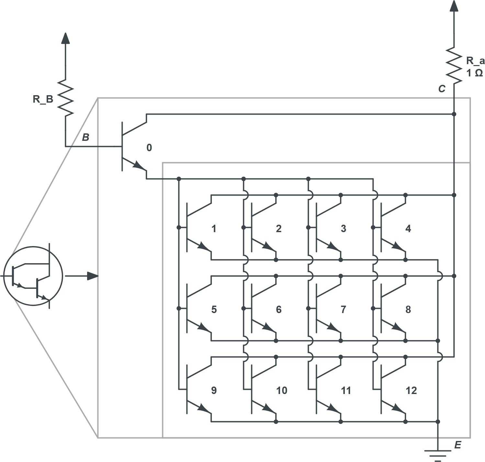
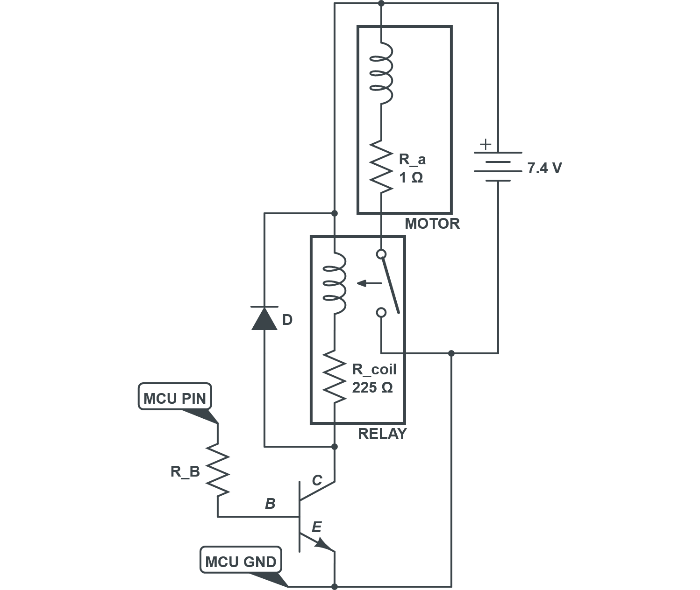

# RC Car Mark II



----

I sought to prove my resourcefulness especially for this project by purchasing no parts for it and using only ones that I had on-hand. This posed a fair challenge.

The car’s power electronics design was carried out after prototyping the chassis and powertrain. However, it will be covered first in following an unbroken sequence of energy transfer from the car’s electronics through to its wheels.



## Power Electronics Design — Custom Unidirectional Motor Driver

The car is designed to be steered rather than reversed; the car has power electronics to run its motor in one direction. To achieve the desired current gain from the car’s microcontroller to its motor upon acceleration, the motor driver will come to have two stages of switching devices. A bidirectional motor driver would use an H-bridge circuit topology, which in turn requires four times as many secondary-stage and twice as many primary-stage switching devices assuming the latter stage is still used, either of which was decided against.

| **Note:** |
|:-----|
| Motor soft start functionality may be implemented using pulse-width modulation (PWM) aboard the car’s microcontroller. |

Naturally, a power transistor was desired for at least the secondary stage (a single-component Darlington transistor would be used for both primary and secondary stages). However, the only solid-state power switching devices on-hand happened to be a mere 1.5-A power transistor and a more capable two-way triode thyristor (TRIAC) which is of course unsuitable. I had many 0.6-A NPN bipolar junction transistors (BJTs) to test in parallel with each other in attempt to increase their current capacity to that drawn by the motor. They were used in a common-emitter amplifier configuration, except not as amplifiers but as switching devices for which they are selected to be in their saturation operating region. The following is a calculation of a current-limiting resistor at the base of each BJT, starting with the assumption that only one stage of switching device(s) is necessary. This assumption will be confirmed or rejected depending on the amount of current draw from a microcontroller output, which will control the switching device(s). The calculation refers to Figure 1 circuit schematics.


The motor armature windings' resistance (R_a) is on the order of magnitude of 1 Ω. The The logical high voltage level of the microcontroller is around 5.0 V = V_BB. The voltage supplied by the two-cell lithium polymer battery is 2 × 3.7 V = 7.4 V = V_CC. The forward/turn-on voltage drop V_D_on of the NP junction modeled as diode D_B is around 0.7 V = v_BE.


For the BJT to have reached saturation and its PN junction to be forward-biased, the resistance at its base must be less than around 64.2 Ω. The closest, most common resistor value is 50 Ω, yet none were available. Two 100 Ω resistors in parallel would be used in lieu if it were not for the maximum rated current draw of 40 mA from the microcontroller output being exceeded nonetheless, by a factor of two:


In other words, even if the selected transistor had sufficient current capacity, it is unsuitable because it does not have the required current gain between the microcontroller and motor.

That being said, it is unclear whether or not the 40-mA rating is actually per microcontroller output pin, as suspected, or per all output pins together. In theory — if the latter — two or three identically controlled pins may be used in parallel. This will not be done for reasons which will become known.

|   |
|:-|
| **Figure 1:** Each BJT, the base resistor R_B, and the armature resistance R_a with now-determined values (all on the left); a model thereof including a controlled current source (all on the right). Naturally, B, C, and E signify the base, collector, and emitter of the BJT. Modified from [1]. |

In attempt to increase the current gain, a Darlington configuration of switching stages will be tested. The emitters of the input and output transistor(s)  and  (primary and secondary switching stages) are shared. The primary collector feeds the secondary base(s). The primary base and secondary collector(s) are the base and collector, respectively, of the Darlington pair.

The current gain becomes β **²** + 2 β and the base–emitter voltage drop becomes twice that of the N-P (negative/positive-doped semiconductor) junctions formed:


That the maximum rated current draw from the microcontroller output is supposedly no longer exceeded. It is now worth determining the voltage left to be supplied to the motor after the collector–emitter voltage drop in saturation v_CE_sat, to which the base–emitter voltage drop is since added:


With this, the inrush current through the motor windings may be calculated:


|  |
|:-|
| **Figure 2:** A motor driver configuration for testing/evaluation, now with a Darlington pair of transistor stages, the latter of which has twelve BJTs in parallel. |

The following is a summary of the power electronics design at this point.

**Which kind of switching device?** \
Medium-power NPN bipolar junction transistors (BJTs) on-hand: `PN2222A-D32`
  
**Which circuit topology/configuration?** \
Overall: common-emitter ~~amplifier~~ <u>switching device</u>; Darlington pair.
  
**Which transistors? How many? How many stages? Which ‘region’ of operation?** \
Stage 1: 600-mA [or less] NPNs (×1) in saturation. Alternative: motor driver board. Stage 2: 600-mA NPNs (×12) pushing saturation.
  
**What current-limiting resistance? Which resistors? How many?**


### Failure Analysis

- Factor 1: One-at-a-time activation and subsequent burnout of all stage 2 BJTs.
  
- Factor 2: Nonzero load (non-frictional) torque (‘freewheeling’).
  
  

### Power Electronics Redesign

To solve the above problem while keeping sufficient current gain, a 10-A relay will be used for the secondary-stage switching device (Figure 3).

|  |
|:-|
| **Figure 3:** A next iteration of the motor driver in which the array of parallel BJTs is swapped out for a relay in the secondary switching stage. The microcontroller output pin and ground are now labeled. The motor and battery are shown as assembled. |

The collector-side resistance is now R_coil rather than R_a:


It is again worth determining the voltage left to be supplied to the motor after the voltage drop across the transistor:


The 225-Ω internal coil resistance of the relay sufficiently limits the amount of current that can flow through the primary-stage BJT to (6.7 V) / (225 Ω) ≈ 29.8 mA.

Again, the inrush current through the motor windings may be calculated:


## Powertrain Design

**Brushed DC electric motor:**
  
- Model airplane propeller drive.
  
- No datasheet or specifications within reach.
  
  ```
  51287V2
  610223-1(B)
  ```

### Drivetrain Design

The project happened to start with creating a differential gearbox, which was successful. However, because of its materials, it occupied more space than desired and thus went unused.

The speed of the motor is unknown but excessive. As such, the gear reduction ratio and thus the gear train present to decrease its speed was designed iteratively — also, to fit the real estate available within the desired sizing and configuration of the car’s chassis. The gear train design includes the individual reduction steps and the counts of each step-down ratio. The final design uses four three-to-one reduction steps for a relatively high total gear ratio (R_tot.) of 81-to-1:


**Alternatives:**

- +1 three-to-one’s  too slow
- −1 three-to-one’s  too fast
- +1 two-to-one’s  not enough chassis space
- −1 three-to-one’s + 1 two-to-one  not enough chassis space — ?
- −2 three-to-one’s + 1 two-to-one  too fast

## Chassis Design

| Components | Dimensions (Approx.) |
| ---------- | -------------------- |
| Frame      | 12 cm × 12 cm        |
| Axle Track | 20 cm                |
| Wheelbase  | ―                    |
| Length     | 17 cm                |

## References

[1] Adel S. Sedra, Kenneth C. Smith, *Microelectronic Circuits*, 7th ed. New York, NY: Oxford University Press, 2015.
